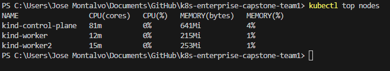
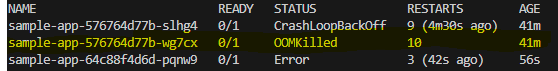

1. Changing resourses(deployment.yaml)
    When changing resourses in the deployment.yaml file only the pod resourses will be changed, This is because only Pod resources are controlled by Kubernetes.
    Using:
            requests:
                cpu: "250m"
                memory: "256Mi"
            limits:
                cpu: "500m"
                memory: "512Mi"

    We can set the requests and limits for the cpu and memory resources for the pod. The requests are the minimum resources that the pod will need to run, while the limits are the maximum resources that the pod can use. If the pod exceeds the limits, it will be terminated and restarted by Kubernetes.

2.  Triggering OOMKilled Scenario (oomD.yaml):
    To trigger an OOMKilled scenario, we can create a pod that consumes more memory than the limits set in the deployment.yaml file. For example, we can create a pod that runs a memory-intensive application that consumes more than 512Mi of memory. When the pod exceeds the memory limit, it will be terminated and restarted by Kubernetes with the OOMKilled status.

3.  Extra notes
    - Memory is a hard limit
    - CPU is a soft limit
    - If a pod exceeds its memory limit, it will be terminated and restarted by Kubernetes with the OOMKilled status.
    - If a pod exceeds its CPU limit, it will be throttled and may experience performance degradation, but it will not be terminated.
