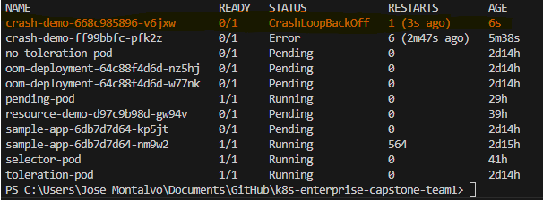
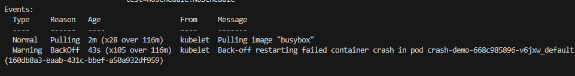
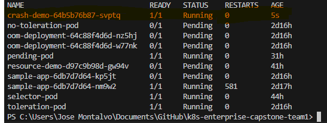
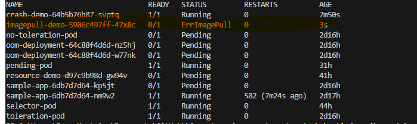
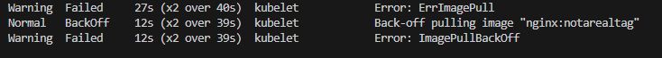
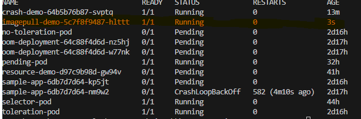
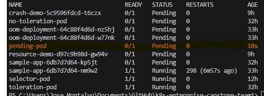
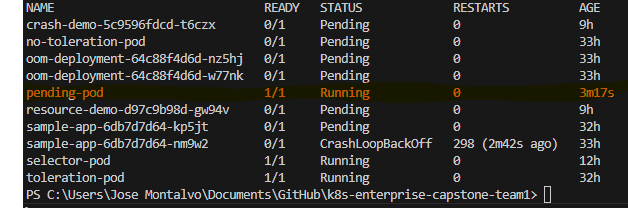
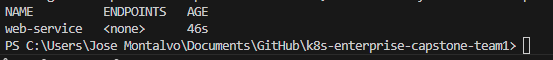
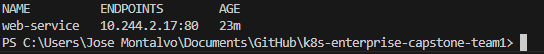

# CrashLoopBackOff Error
I have a pod that is in a CrashLoopBackOff state: 

The error is "Back-off restarting failed container". This means that the container in the pod is crashing and Kubernetes is trying to restart it, but it keeps failing. To troubleshoot this issue, I can check the details of the pod to see why it is crashing. I will run the following command: 
- kubectl describe pod crash-demo 
I get this Event: 
 
This is because I am running the command 
- #command: ["sh", "-c", "exit 1"]
 
This command will cause the container to exit with a status code of 1, which indicates an error. To fix this issue, I will update my .yaml file to run a command that does not cause the container to crash. For example, I can change the command to:
 
- command: ["sh", "-c", "while true; do sleep 30; done"] 
This command will keep the container running indefinitely, allowing me to troubleshoot any issues without it crashing. After updating the .yaml file and applying the changes, my pod is now running successfully: 

# ImagePullBackOff Error
I have a pod that is in an ImagePullBackOff state: 
 
The error is "Back-off pulling image". This means that Kubernetes is trying to pull the container image for the pod, but it is failing. To troubleshoot this issue, I can check the details of the pod to see why it is failing to pull the image. I will run the following command:
- kubectl describe pod image-pull-demo
I get this Event: 
 
This is because the image "nginx:latest" is not available in the container registry. To fix this issue, I will update my .yaml file to use a valid image that is available in the registry. For example, I can change the image to "nginx:1.27". After updating the .yaml file and applying the changes, my pod is now running successfully: 
 

# Pending work loads
Currently i have a pending crash-demo pod: 
 

The error is "0/3 nodes are available: 3 node(s) had taint {dedicated=experimental:NoSchedule}, that the pod didn't tolerate." 
This means that the pod is not scheduled because it does not have a toleration for the taint on the node. To fix this, I need to add a toleration to the pod that matches the taint on the node. I will update my .yaml file to include the following toleration: 

`tolerations:
      - key: "node-role.kubernetes.io/control-plane"
        operator: "Exists"
        effect: "NoSchedule"

      - key: "dedicated"
        operator: "Equal"
        value: "experimental"
        effect: "NoSchedule"

      - key: "test"
        operator: "Equal"
        value: "noschedule"
        effect: "NoSchedule"`

After updating the .yaml file and applying the changes, my pod is now running successfully:

# Service selector mismatch
I created a service and Deployment .yaml webservice file however, the endpoint cannot connect: 
 
The error is "Endpoints: < none >". This means that the service is not able to find any pods that match its selector. To fix this issue, I need to ensure that the labels on the pods created by the Deployment match the selector specified in the Service. I will update my Deployment .yaml file to include the correct labels that match the Service selector. After updating the .yaml file and applying the changes, my service is now able to connect to the pods successfully: 
 

