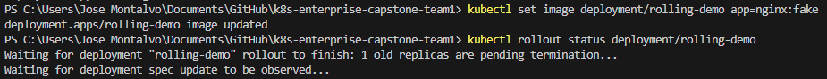
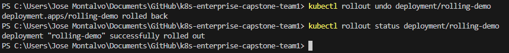

# Rollout outputs: Evidence 
```
PS C:\Users\Jose Montalvo\Documents\GitHub\k8s-enterprise-capstone-team1> kubectl set image deployment/rolling-demo app=nginx:1.27
deployment.apps/rolling-demo image updated

PS C:\Users\Jose Montalvo\Documents\GitHub\k8s-enterprise-capstone-team1> kubectl rollout status deployment/rolling-demo
deployment "rolling-demo" successfully rolled out

PS C:\Users\Jose Montalvo\Documents\GitHub\k8s-enterprise-capstone-team1> kubectl rollout undo deployment/rolling-demo  
deployment.apps/rolling-demo rolled back

PS C:\Users\Jose Montalvo\Documents\GitHub\k8s-enterprise-capstone-team1> kubectl set image deployment/rolling-demo app=nginx:fake
deployment.apps/rolling-demo image updated

PS C:\Users\Jose Montalvo\Documents\GitHub\k8s-enterprise-capstone-team1> kubectl rollout status deployment/rolling-demo
Waiting for deployment "rolling-demo" rollout to finish: 1 old replicas are pending termination...
```




# Deployment Strategies

## Blue-Green

This create to enviornments, blue and green. One is active while the other is idle. Once a new version of the application is created the idle enviornment is updated. Afterwords trafic is swiched to the updateded application. If for whatever reason you need to go back an udate you can move trafic back to the old version.

Pros: little to no downtime if green fails you can switch back to blue.

Cons: 2 enviornments must be maintained increasing the workload

## Canary

When a new version is released, only a few users will recieve the new version. The trafic is then slowly increased if no errors are discovered. It is similar to a beta version that you can opt into useing.

Pros: A small number of users are impacted

Cons: small sample size.

## Rollout
This is the default strategy for Kubernetes. It updates the application one pod at a time. If an error is discovered the rollout can be stopped and rolled back. 

Pros: No downtime, if an error is discovered you can stop the rollout and roll back.

Cons: If an error is discovered you have to wait for the rollout to stop and roll back.
