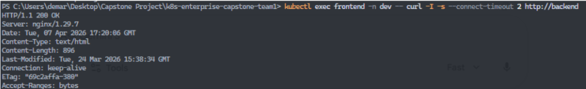

# Allowed and blocked traffic

We applied a Default Deny NetworkPolicy to the dev namespace which locks incoming traffic (ingress) to every pod by default. This enables zero trust where all communication is blocked unless given a allow rule.

Then we applied the allow rule (allow-frontend-backend.yaml). Only pods with the label app: frontned and port 80 are allowed to communicate with the backend.

Frontend -> backend kubectl exec curl test output (allowed):

Other pod -> backend kubectl exec curl test output (blocked):

