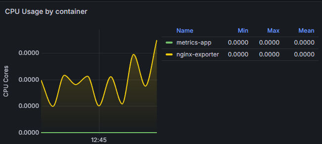
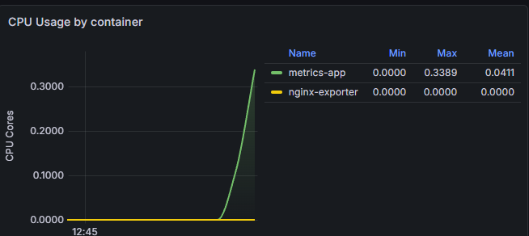
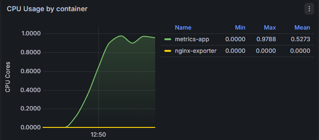

# Incident Report

Option B: Resource saturation (CPU or memory)

Ran the command: `kubectl exec -it $(kubectl get pod -l app=sample-metrics-app -n dev -o jsonpath='{.items[0].metadata.name}') -n dev -- /bin/bash -c "yes > /dev/null"` for 5 minutes.

Timeline:
12:45: CPU usage at 0.0000 
12:46: CPU usage at 0.3389 
12:50: CPU usage at 0.9788 

- What broke during incident simulation:

  The metrics-app container had CPU Saturation. It went from 0.0000 to 0.9788.

- How it was detected:

  In Grafana and kubectl. In Grafana under the CPU usage by container section the metrics-app and graph had a upward spike. In kubectl, using `kubectl top pod -n dev` showed a upward trend in CPU usage.

  Before simulation:
  PS C:\Users\demar\Desktop\Capstone Project\k8s-enterprise-capstone-team1> kubectl top pod -n dev
  NAME CPU(cores) MEMORY(bytes)  
   sample-app-866c95dcf-zp8hf 0m 6Mi

  After simulation:
  NAME CPU(cores) MEMORY(bytes)  
   sample-app-866c95dcf-zp8hf 981m 7Mi

- Steps to repair:

  Stopped the command: `kubectl exec -it $(kubectl get pod -l app=sample-metrics-app -n dev -o jsonpath='{.items[0].metadata.name}') -n dev -- /bin/bash -c "yes > /dev/null"`

- Lessons learned:

  This simulation showed the importance of resource limits. sample-app didn't have resource limits so during heavy traffic it took up 97% of the CPU which would prevent other pods from getting CPU time in a real application.
