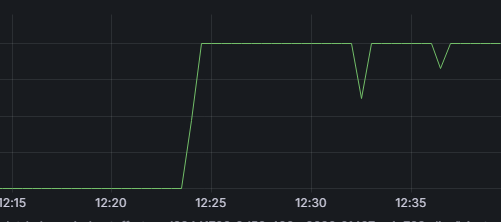
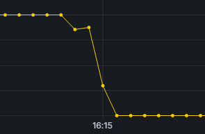

# Incident Report

## Option B

After running 
```
PS C:\Users\Jose Montalvo\Documents\GitHub\k8s-enterprise-capstone-team1> kubectl exec -it demo-app-9444d5b6b-8dmmj -- sh
/ # yes > /dev/null
```
We notice a spike in cpu usage, from 0 to 1.00 and platoes arount 1.00
<br>
 

## What happened?

The demo app was running a command that causes it to consume 100% of the CPU, which is not ideal for a production environment. This could lead to performance issues and potentially cause other applications running on the same node to be affected.

## How did we detect it?
We detected the issue by monitoring the CPU usage of the demo app using Prometheus and Grafana. We noticed a sudden spike in CPU usage, which prompted us to investigate further and identify the root cause of the problem. 

We can use kubectl top pod to also see the large increase in corse being used
## How did we fix it?

We canceled the command making the cpu run at 100 by using Ctrl + C. This lets the pod return to its idle state which is expresses in this graph


## Leasons learned
1. It's important to monitor the resource usage of applications running in a Kubernetes cluster to identify potential issues before they become critical.
2. Running resource-intensive commands or applications in a production environment can lead to performance issues and should be avoided.
3. Using tools like Prometheus and Grafana can help us quickly identify and troubleshoot issues in our applications and infrastructure.
4. It's important to have a plan in place for how to respond to incidents and quickly mitigate any issues that arise in a production environment.
